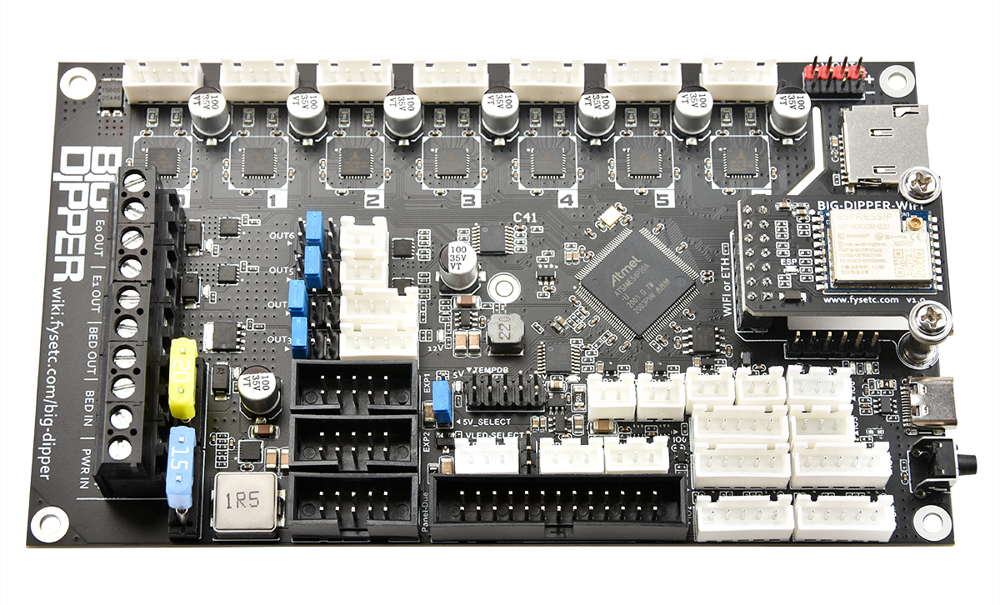

# Big dipper



## 1. Introduction

FYSETC BIG DIPPER motherboard, reprap firmware(RRF), 32bit 3d pirnter motherboard base on DUET3 mini5+ and mini2+. Based on the good ecology of the RRF firmware and on-board 7-axis (7xTMC2209), the board can be easily configured in a variety of 3D printer models, such as VORON series, Annex Engineering K3, multi-Z-axis models, double-X models etc.

### 1.1 Changes

Compared with DUET3 mini5+, following are changed

1. Two more TMC2209 added; The power supply of the fan can be freely selected 5V/12V/24V; 

2. the network interface can be freely selected through an external module WIFI/network cable interface, 

3. USB interface uses Tpye-C interface

## 2. Firmware

The motherboard is developed on the basis of the due3mini5+ motherboard, and the firmware is compatible. 

Duet3 mini5+ user guide:

https://duet3d.dozuki.com/Wiki/Getting_Started_with_Duet_3_Mini_5plus

duet3mini5+ firmware:

https://github.com/Duet3D/RepRapFirmware/releases

### 2.1 Steps to use RRF

- **Step 1: Power supply**

  The motherboard needs to provide a 24V power supply, and the jumper cap in the 5V_SELECT position is required to select 5V&DCV

  

- **Step 2: Update firmware**

  The firmware of the motherboard may not be the latest when it leaves the factory. You can use USB to upgrade the firmware, download the latest firmware, connect to the computer via USB, and quickly press the motherboard reset button twice, then a new disk will appear on the computer. Just copy the firmware

- **Step 3: config**

  There is a `config` folder in the `Firmware` folder next to this readme file, which is just a sample configuration for running RRF. Copy all the contents of the config folder to the root directory of sdCard, and insert the sdCard into the card slot of the big-dipper motherboard.

## 3. Hardware

If you want to build a machine with RRF firmware on the big-dipper motherboard, then you can use four ways to communicate/control with big-dipper. They are USB serial, mini12864, Panel-due and Ethernet/WIFI Module. And you can get sch files on Hardware folder next to this README.

### 3.1 USB serial

After the motherboard is correctly connected to the power supply, insert the SDcard and the sample configuration (you are recommended to configure it yourself), and then use the USB data cable to connect to the computer, you can use RRF Gcode to control the motherboard.

### 3.2 FYSETC mini12864

This is a low-cost external display/control solution. You can use FYSETC mini12864 by adding the following code to the config.g file (the sample configuration has been added)

```
M918 P2 E2 F2000000 C40 R6			; enable ST7567-based 12864 display
M150 X2 R255 U255 B255 S3			; set all 3 LEDs to white
```


### 3.3 Panel-due

Compared to mini12864 using a rotary encoder to control the motherboard, it is more convenient to use Panel-due with touch control. You only need to add the following code to the config.g configuration file (the sample configuration has been added)

There are two ways to connect the screen to the motherboard:

1. Use XH2.54 interface to connect, pay attention to the need to adjust the line sequence

2. Use 2x5 cable connection

```
M575 P1 S1 B57600                   ; enable support for PanelDue
```


### 3.4 Ethernet/WIFI Module

#### 3.4.1 Ethernet Module

If you use the Ethernet module, you need to add the following code in config.g (NO need for wifi module).

```
M552 P0.0.0.0 S1    ; enable network and acquire dynamic address via DHCP
```

After connecting to the Ethernet, the panel-due screen or serial port will output the IP address (192.168.x.xxx), and you can open the Duet Web Control in the computer web page WITH this IP address.

#### 3.4.2 WIFI Module

If you use the wifi module, you need to manually configure the SSID and PASSWORRD (you can use the serial port to send instructions)

1. Stop wifi module

   ```
   M552 s-1
   ```

   You should receive `WiFi module stopped`.

2. Start wifi module

   ```
   M552 s0
   ```

   You should receive `WiFi module started`.

3. Setup your wifi network SSID and password.

   ```
   M587 S"ssid" P"password"
   ```

   The module should connect to your wifi network in 30s.

## 4. Other features

### Driver 0~6

```
M569 P0.0 S0       ; physical drive 0.0 goes forwards
M569 P0.1 S0       ; physical drive 0.1 goes forwards
M569 P0.2 S0       ; physical drive 0.1 goes forwards
M569 P0.3 S0       ; physical drive 0.2 goes forwards
M569 P0.4 S0       ; physical drive 0.3 goes forwards
M569 P0.5 S0       ; physical drive 0.4 goes forwards
M569 P0.6 S0       ; physical drive 0.5 goes forwards
```

