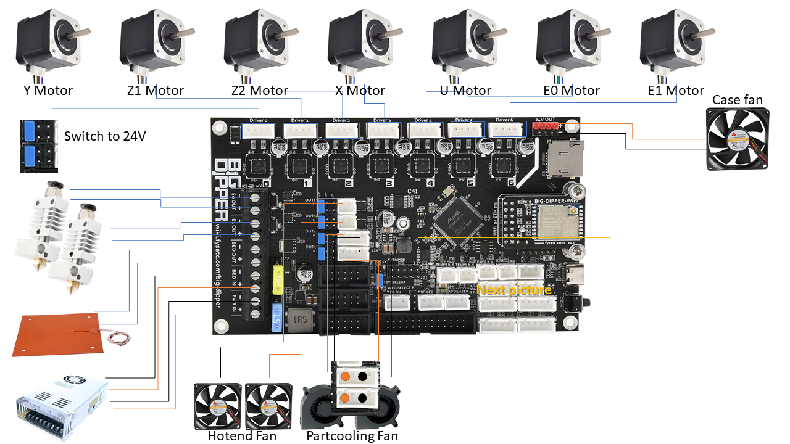
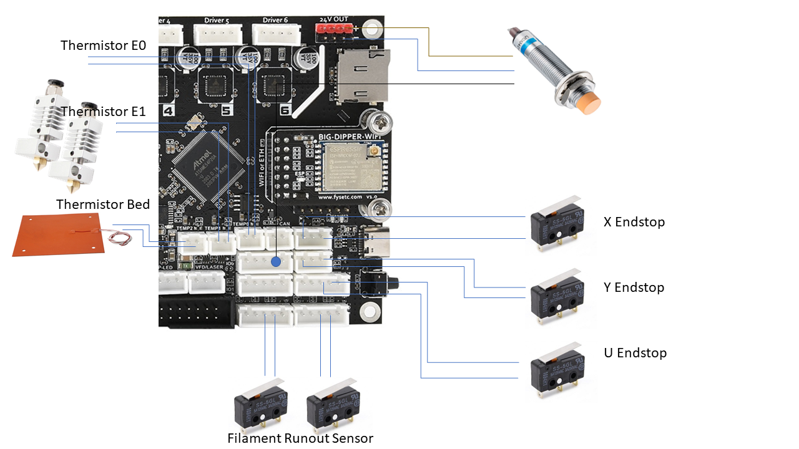
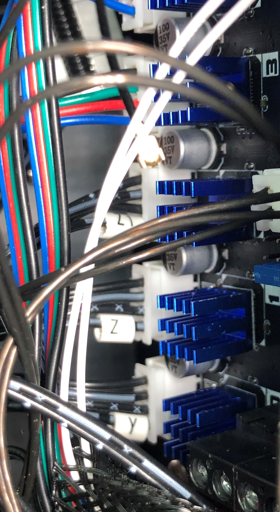
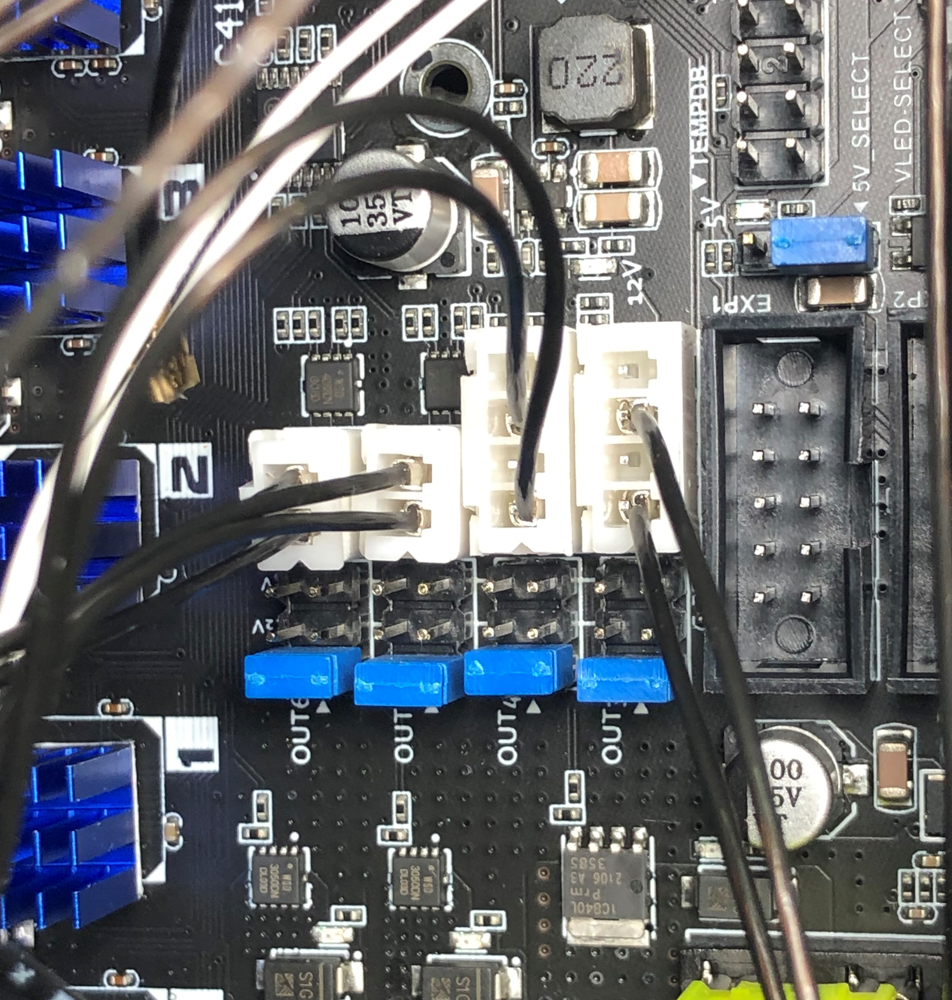
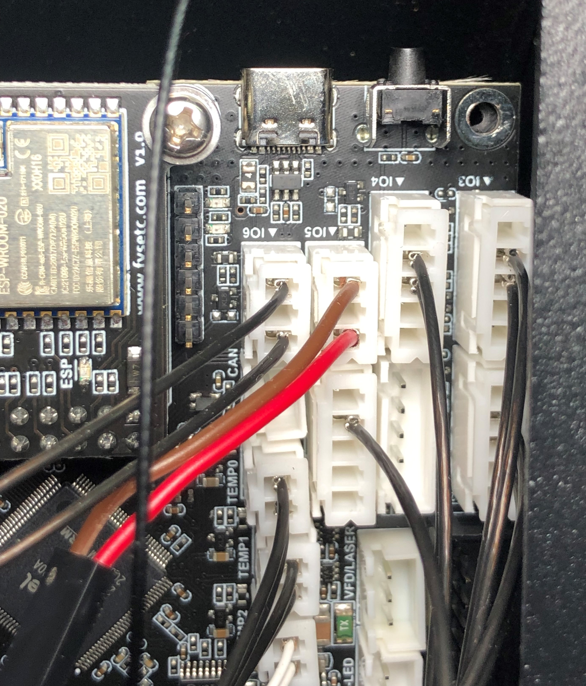
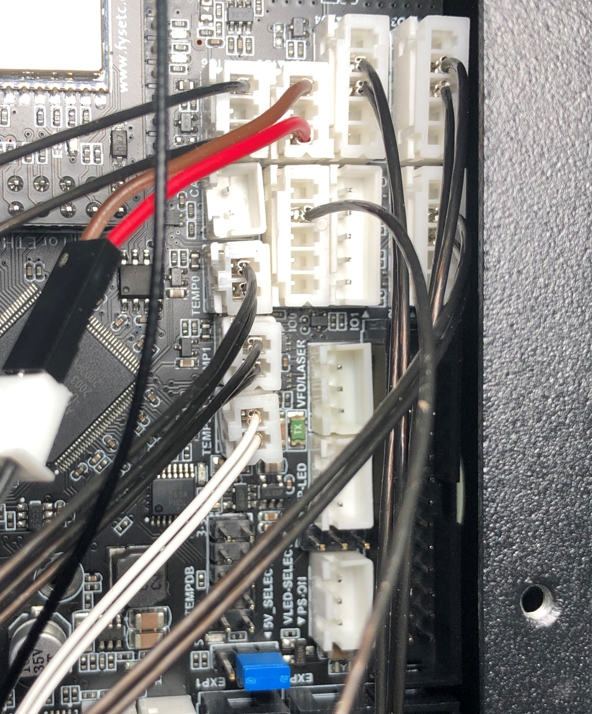
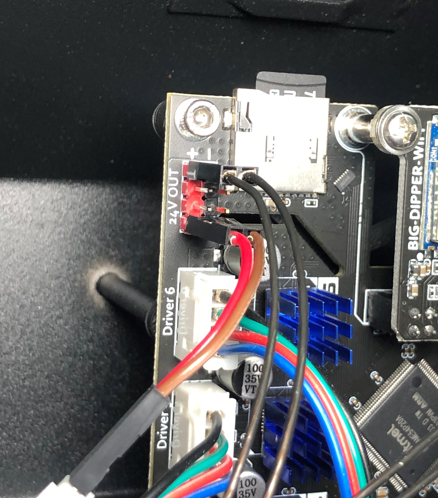

# Using the Fysetc Big Dipper to build an IDEX 3D printer with RepRap Firmware printer

## Wire Diagram
This is how I wired the IDEX printer with his two extruders, dual axis and all endstops.

If it is not clear to see, I also did some pictures.
For the Y and both Z Motors, I used the exising cables. For both E and X I bought new cables with 1m length.

For the Fans on the Hotend you need to set the Jumpers to 24V. See the pinning on the picture.

Also for the Endstops and the proximity sensor the Pinning is very impotant. There is no polarity but you have to take the right PINs in the JST-XH connectors.

For the Probe I needed for this project also +24V and for the Casefan there was no additional Fan Plug free. So both went to 24V.

## PINout
| Function | PIN | comment |
| --- | --- | --- |
| Y Axis Motor | Driver 0 | |
| Z1 Axis Motor | Driver 1 | |
| Z2 Axis Motor | Driver 2 | |
| X Axis Motor | Driver 3 | left Printhead |
| U Axis Motor | Driver 4 | right Printhead |
| E0 Axis Motor | Driver 5 | left Extruder |
| E1 Axis Motor | Driver 6 | right Extruder |
| PSU 24V | Pwr in | |
| PSU 24V | Bed in | |
| Heated Bed | Bed out | |
| Hotend E0 | E0 out | left Printhead |
| Hotend E1 | E1 Out | right  Printhead |

## Tasks
[ ] PINout  
[ ] Firmware
